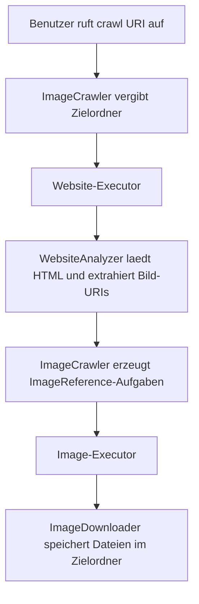

# Entwurf: Paralleler Image Crawler

## Ziel des Programms

Das Programm implementiert einen einfachen Webcrawler, der eine oder mehrere angegebene Webseiten lädt, dort nach normalen HTML-``-Tags sucht und die gefundenen Bilder herunterlädt. Der Crawler folgt keinen Links auf andere HTML-Seiten und führt auch kein JavaScript aus. Der betrachtete Ausschnitt ist dadurch bewusst klein gehalten: Eine Webseite wird analysiert, ihre Bildadressen werden extrahiert, und diese Bilder werden unter einem konfigurierten Download-Pfad gespeichert.

Für jeden Aufruf von `crawl(uri)` wird ein eigener Zielordner angelegt. Die Ordner heißen `1`, `2`, `3` usw. und liegen direkt unter dem konfigurierten Download-Verzeichnis. Diese Nummerierung richtet sich nach der Reihenfolge der `crawl`-Aufrufe und wird auch dann korrekt vergeben, wenn mehrere Threads gleichzeitig neue Webseiten einreichen.

## Architektur

Die zentrale Klasse ist `ImageCrawler`. Sie nimmt neue Crawl-Aufträge entgegen, vergibt den Zielordner und koordiniert die parallele Arbeit. Dabei führt `ImageCrawler` selbst keine HTML-Analyse und keinen direkten Datei-Download durch, sondern delegiert diese Aufgaben an zwei spezialisierte Klassen.

`WebsiteAnalyzer` ist für das Laden der HTML-Seite und das Extrahieren der Bild-URIs zuständig. Die Klasse verwendet den Java-`HttpClient` für den HTTP-Request und Jsoup für das Parsen des HTML-Dokuments. Relative Bildpfade werden mit der ursprünglichen Webseiten-URI als Basis aufgelöst. Nicht unterstützte oder ungültige Bildadressen, zum Beispiel `data:`- oder `ftp:`-URIs, werden übersprungen.

`ImageDownloader` lädt anschließend die Bilddaten über HTTP oder HTTPS herunter und speichert sie im passenden Zielordner. Die Ermittlung eines eindeutigen Dateinamens ist in `FileNameResolver` ausgelagert. Dadurch bleibt die Klasse für den eigentlichen Download übersichtlich und die Sonderlogik für doppelte Dateinamen ist an einer Stelle gekapselt.

Als kleine Datenklasse wird `ImageReference` verwendet. Sie enthält die Bild-URI und das Zielverzeichnis, in das das Bild geschrieben werden soll.

## Modularisierung und Datenfluss

Der Datenfluss beginnt beim Aufruf von `crawl(uri)`. `ImageCrawler` erzeugt daraus eine Webseiten-Aufgabe und legt direkt fest, welcher nummerierte Ordner zu diesem Aufruf gehört. Danach wird die Aufgabe an den Executor für Webseiten-Scans übergeben.

Wenn ein Worker diese Aufgabe ausführt, ruft er `WebsiteAnalyzer.analyze(uri)` auf. Das Ergebnis ist eine Liste bereits aufgelöster Bild-URIs. Für jede dieser URIs erstellt `ImageCrawler` eine `ImageReference` und reicht sie an den zweiten Executor weiter. Dort übernehmen die Download-Worker die Arbeit und rufen `ImageDownloader.download(reference)` auf. Am Ende schreibt `ImageDownloader` die Datei in den zugeordneten Ordner.

Der Crawler besteht damit aus einer einfachen Pipeline:

1. Webseite entgegennehmen und Zielordner festlegen
2. HTML laden und Bildadressen extrahieren
3. Bild-Download-Aufgaben erzeugen
4. Bilddaten laden und speichern

## Parallelisierte Bereiche

Die Webseitenanalyse und die Bilddownloads sind getrennt parallelisiert. `ImageCrawler` besitzt dafuer zwei feste Threadpools. Der erste Pool begrenzt die Anzahl gleichzeitig laufender Webseiten-Scans auf `getNumberOfAllowedParallelWebsiteScans()`. Der zweite Pool begrenzt die gleichzeitigen Bilddownloads auf `getNumberOfAllowedParallelImageDownloads()`.

Diese Trennung ist wichtig, weil beide Arbeitsarten unterschiedliche Eigenschaften haben. Das Laden einer HTML-Seite kann blockieren, waehrend gleichzeitig bereits gefundene Bilder heruntergeladen werden koennen. Ein langsamer Bilddownload soll also nicht verhindern, dass weitere Webseiten analysiert werden, solange im Webseiten-Pool noch Kapazitaet frei ist. Umgekehrt sollen viele Webseiten-Scans nicht dazu fuehren, dass unbegrenzt viele Bilddownloads parallel starten.

## Algorithmische Strategie-Patterns

Der Entwurf nutzt Task Parallelism, weil jede Webseitenanalyse und jeder Bilddownload als eigene Aufgabe betrachtet wird. Diese Aufgaben koennen unabhaengig voneinander ausgefuehrt werden, solange die konfigurierten Parallelitaetsgrenzen eingehalten werden.

Zusätzlich entsteht eine Pipeline-Struktur. Die Webseitenanalyse produziert Bild-URIs, die danach als Eingabe fuer die Download-Stufe dienen. Zwischen beiden Stufen koordiniert `ImageCrawler`, aber die fachlichen Schritte bleiben getrennt.

Außerdem entspricht die Struktur einem einfachen Master/Worker-Ansatz. `ImageCrawler` uebernimmt die Rolle des Masters: Er nimmt Auftraege entgegen, zaehlt den Zustand mit und verteilt die Arbeit. Die Worker werden durch die beiden `ExecutorService`-Instanzen bereitgestellt.

## Implementierungsstrategie und Thread-Safety

Die kontrollierte Parallelitaet wird mit `ExecutorService` und festen Threadpools umgesetzt. Dadurch muss das Programm keine eigenen Worker-Schleifen oder Blocking Queues manuell verwalten. Die Executor-Queues uebernehmen das sichere Einreihen wartender Aufgaben.

Der Zustand des Crawlers wird mit mehreren `AtomicInteger`-Zaehlern verfolgt:

- wartende Webseiten-Aufgaben
- laufende Webseiten-Aufgaben
- wartende Bild-Aufgaben
- laufende Bild-Aufgaben
- Nummerierung der Crawl-Zielordner

`isIdle()` liest diese Zaehler atomar aus und gibt nur dann `true` zurueck, wenn alle vier Arbeitszaehler den Wert `0` haben. Wichtig ist, dass eine Aufgabe bereits vor dem Einreichen beim Executor als wartend gezaehlt wird. Sobald ein Worker sie wirklich startet, wird sie von "wartend" nach "laufend" verschoben. In `finally`-Bloecken wird der laufende Zaehler wieder reduziert, sodass auch Fehlerfaelle den Zustand nicht dauerhaft verfaelschen.

Fuer die Dateinamen wird bewusst nur ein kleiner synchronisierter Bereich verwendet. `FileNameResolver.resolveTargetPath(...)` muss pro Zielordner wissen, wie oft ein Dateiname bereits vergeben wurde. Diese Map wird innerhalb der Methode geschuetzt, damit zwei parallele Downloads nicht denselben Namen erhalten. Der eigentliche HTTP-Download und das Schreiben der Datei liegen nicht in diesem Lock.

## Fehlerbehandlung

Fehler einzelner Webseiten oder Bilder beenden den Crawler nicht. Wenn eine Webseite nicht erfolgreich geladen werden kann oder einen HTTP-Fehlerstatus liefert, gibt `WebsiteAnalyzer` eine leere Ergebnisliste zurueck. Wenn ein Bild nicht heruntergeladen werden kann, ignoriert `ImageDownloader` diesen einzelnen Download. Dadurch koennen andere Webseiten und Bilder weiterverarbeitet werden.

Ungueltige oder nicht unterstuetzte Bildadressen werden ebenfalls uebersprungen. Der Crawler bleibt damit robust gegen typische HTML-Inhalte, bei denen nicht jede Referenz tatsaechlich ein direkt ladbares Bild ist.
